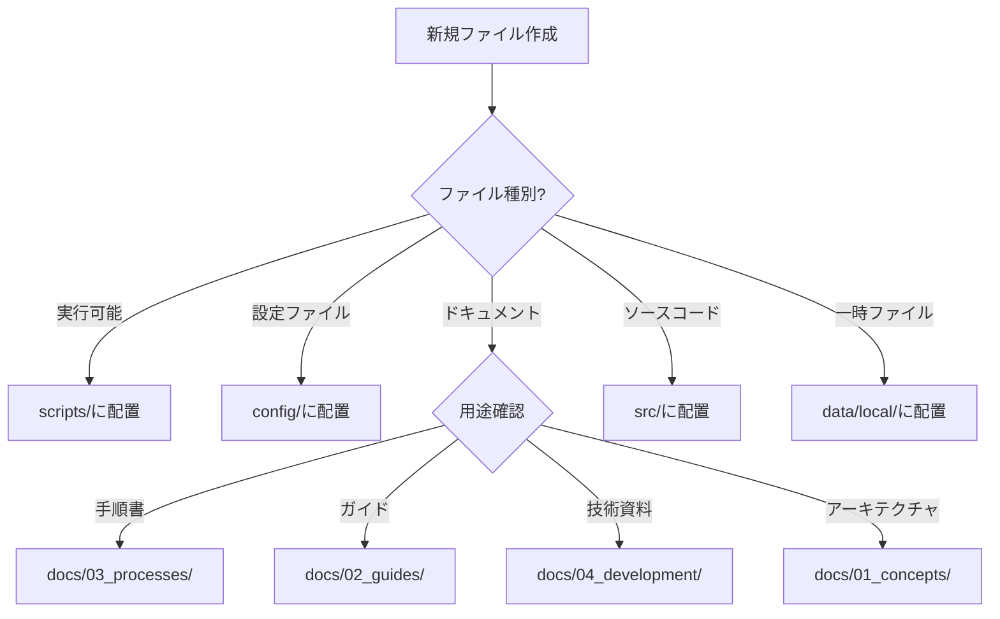

# 📁 ファイル・フォルダ組織ルール

**最終更新**: 2025-07-08T02:30:00+09:00  
**状態**: PRESIDENT承認済み

## 🎯 根本原則

### 1. ルート整理の絶対ルール
- **Single-screen rule**: ルートディレクトリの全項目は一画面で表示可能であること
- **12ファイル制限**: ルートには最大12個までのファイル/フォルダのみ許可
- **即時整理**: 新規ファイルは24時間以内に適切なディレクトリに移動

### 2. o3/Gemini確認が必要な場合
- **ルートファイル追加時**: 必ずo3とGeminiの両方に確認
- **ディレクトリ構造変更時**: docs/構造への影響がある場合
- **大量ファイル削除時**: 5個以上のファイル削除
- **重要システムファイル操作時**: .specstory/, .vscode/, CLAUDE.md関連

### 3. DB vs ローカルストレージ棲み分け

#### データベース格納対象 (`src/memory/persistent-learning/`)
- **永続化必須データ**: mistakes-database.json
- **学習データ**: パターン認識、行動履歴
- **設定データ**: hooks設定、AI組織設定
- **監査ログ**: セキュリティイベント、アクセス記録

#### ローカルストレージ対象 (`data/local/`, `runtime/`)
- **一時ファイル**: temp_*, scratch_*, cache_*
- **ログファイル**: システムログ、デバッグ出力
- **バックアップ**: script_backups/, session_state
- **ワークファイル**: current-tasks.md, work-checklist.md

## 🛡️ 絶対保護対象

### 絶対に削除・移動禁止
```
.specstory/          # プロジェクト仕様管理
.vscode/             # IDE設定
CLAUDE.md            # AI記憶継承システム
src/memory/core/     # 記憶システムコア
mistakes-database.json # 78回ミス履歴
```

### 保護メカニズム
1. **Git属性設定**: .gitattributes で削除防止
2. **Pre-commit hooks**: 削除試行時にブロック
3. **ファイル権限**: chmod 444 (読み取り専用)
4. **バックアップ**: 1日3回自動バックアップ

## 📂 ディレクトリ配置ルール

### ルートディレクトリ (許可リスト)
```
CHANGELOG.md         # プロジェクト変更履歴
CLAUDE.md            # AI記憶継承(固定パス)
Index.md             # プロジェクト起点
LICENSE              # ライセンス情報
Makefile             # タスク実行
README.md            # プロジェクト説明
pyproject.toml       # Python設定
startup_checklist.md # → docs/02_guides/に移動済み
config/              # 設定ファイル群
docs/                # ドキュメント群
scripts/             # 実行可能スクリプト
src/                 # ソースコード
tests/               # テストコード
runtime/             # 実行時データ
```

### docs/ 構造ルール
```
docs/
├── 00_INDEX/        # ナビゲーション・案内
├── 01_concepts/     # 設計思想・アーキテクチャ
├── 02_guides/       # セットアップ・操作ガイド
├── 03_processes/    # 運用手順・チェックリスト
├── 04_development/  # 技術開発・監査レポート
├── 04_reference/    # API仕様・技術資料
└── _archive/        # 過去ログ・廃止文書
```

### 新規ファイル分類フロー


## 🔄 自動強制メカニズム

### 1. PRESIDENT宣言時チェック
```python
def president_declaration_check():
    root_files = count_root_files()
    if root_files > 12:
        return ERROR("ルート整理未完了")
    
    protected_files = check_protected_files()
    if not protected_files:
        return ERROR("保護対象ファイル消失")
```

### 2. Hook統合チェック
- **PreToolUse**: ファイル操作前の組織ルール検証
- **PostToolUse**: 操作後の整理状態確認
- **File deletion prevention**: 保護対象ファイルの削除阻止

### 3. 日次整理チェック
```bash
# daily_check.sh内で実行
check_root_organization
check_protected_files
check_data_separation
```

## 🎯 プロダクト全体整合性

### 1. 命名規則統一
- **スクリプト**: `verb-noun.sh` (例: check-status.sh)
- **設定**: `config-name.json` (例: hooks-config.json)
- **ドキュメント**: `topic-name.md` (例: memory-system.md)

### 2. パス参照標準化
- **絶対パス禁止**: 全て相対パス使用
- **環境変数**: `$PROJECT_ROOT` ベースで統一
- **スクリプト**: `$(dirname "${BASH_SOURCE[0]}")` パターン

### 3. 整合性チェック
```bash
# 週次実行
scripts/verify.sh all
scripts/utilities/comprehensive-structure-evaluation.py
```

---

**重要**: このルールは78回のミス履歴から学習した絶対遵守事項です。
**違反時**: 即座に警告発出、Runtime Advisorによる自動修正実行