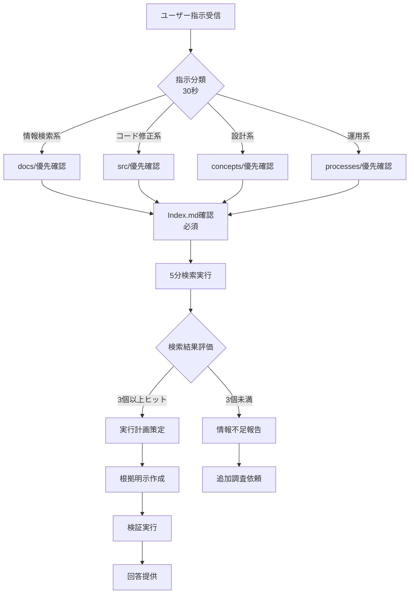

# 指示対応フロー - ベストプラクティス

**目的**: 推測を排除し、ドキュメントと事実に基づく確実な対応を実現

## 🔄 指示対応フロー図



## 📋 Phase別詳細手順

### Phase 1: 受信・分類（30秒）

#### 1-1. 指示内容の即座分類
```bash
# 分類基準
- 情報検索系: "〜について教えて" "〜はどこ？" "〜の仕組みは？"
- コード修正系: "〜を修正" "〜を実装" "バグ修正"
- 設計系: "〜の設計" "アーキテクチャ" "構造"
- 運用系: "〜を実行" "セットアップ" "デプロイ"
```

#### 1-2. 優先度判定
```bash
# 緊急度マトリクス
高緊急 + 高重要 = 即座対応（ただし2分検索は必須）
低緊急 + 高重要 = 通常フロー厳守
高緊急 + 低重要 = 簡易確認後対応
低緊急 + 低重要 = 通常フロー
```

### Phase 2: インベントリ確認（2分）

#### 2-1. Index.md確認（必須）
```bash
# コマンド例
cat Index.md | grep -i "キーワード"

# 確認ポイント
- 該当機能の記載箇所
- 関連ドキュメントへのリンク
- 最終更新日時
```

#### 2-2. docs/構造確認
```bash
# 優先順位付き確認順序
1. docs/00_INDEX/README.md     # 全体索引
2. docs/03_processes/          # プロセス・手順
3. docs/01_concepts/           # 設計思想
4. docs/02_guides/             # 操作ガイド
5. docs/04_reference/          # 技術仕様
6. docs/_archive/              # 過去ログ（最後）
```

#### 2-3. DB/ログ確認判定
```bash
# 即確認トリガーワード
- データ系: "最新" "現在" "統計" "一覧" "レポート"
- 障害系: "エラー" "障害" "失敗" "動かない"
- 状態系: "設定" "状態" "ステータス" "確認"

# 確認対象
runtime/
├── *.json          # 状態・設定ファイル
├── logs/           # 実行ログ
├── session_*.log   # セッション記録
└── daily_check.log # 日次チェック結果
```

### Phase 3: 5分検索実行（5分）

#### 3-1. 検索スクリプト実行
```bash
# 基本実行
./scripts/utilities/5min-search.sh "キーワード"

# 複合検索
./scripts/utilities/5min-search.sh "キーワード1" | grep "キーワード2"

# 結果保存
./scripts/utilities/5min-search.sh "キーワード" > /tmp/search_$(date +%Y%m%d_%H%M%S).log
```

#### 3-2. 検索結果評価基準
```bash
# 回答可能判定
✅ 関連ファイル3個以上
✅ 具体的実装・設定確認済み
✅ 最新状態把握済み

# 情報不足判定
❌ 関連情報2個以下
❌ 推測が必要な部分あり
❌ 実行結果未確認
```

### Phase 4: 実行計画策定（25分）

#### 4-1. 根拠明示テンプレート
```markdown
## 実行計画

### 根拠情報
- 参照ドキュメント: [具体的パス]
- 検索結果: [5min-search出力要約]
- データ確認: [runtime/確認内容]

### 実行内容
1. 確定事項
   - XXX（根拠: docs/path/file.md）
   - YYY（根拠: 検索結果3件）

2. 仮説事項
   - ZZZ（要検証: 理由）

3. 不明事項
   - AAA（追加調査必要）
```

#### 4-2. リスク評価
```bash
# 影響範囲チェック
- 単体機能のみ: 低リスク
- 複数機能連携: 中リスク → 追加テスト必須
- システム全体: 高リスク → 段階実行必須
```

### Phase 5: 検証実行（5-10分）

#### 5-1. 自動検証
```bash
# Makefile活用
make test           # テスト実行
make lint           # コード品質
make status         # システム状態
make validate       # 構造検証
```

#### 5-2. 手動確認項目
```bash
# チェックリスト
□ ドキュメント更新必要性
□ 関連ファイル影響確認
□ ログ出力正常性
□ エラーハンドリング
```

## 🚨 アンチパターン（絶対回避）

### ❌ してはいけないこと
1. **即座推測回答** - 0.5秒で答え始める
2. **根拠なし断定** - 「多分〜だと思います」
3. **検索スキップ** - 「知ってるから大丈夫」
4. **部分理解実行** - 全体像把握前の実装
5. **検証省略** - 「動くはず」での完了

### ✅ 必須実施事項
1. **30秒思考停止** - 分類・優先度判定
2. **2分インベントリ** - Index.md・docs確認
3. **5分検索実行** - 推測防止の物理的担保
4. **根拠明示** - 全判断にソース付記
5. **検証完了** - 動作確認での締め

## 📊 効果測定指標

### KPI設定
```yaml
正確性:
  - 初回正答率: 90%以上
  - 修正要求率: 10%以下

効率性:
  - 平均対応時間: 30分以内
  - 再調査率: 5%以下

品質:
  - 根拠提示率: 100%
  - 検証実施率: 100%
```

### 週次レビュー項目
1. 推測回答発生回数
2. ドキュメント参照率
3. 5分検索実施率
4. ユーザー満足度

## 🔧 支援ツール

### 利用可能コマンド
```bash
# フロー支援
make handle-instruction      # 対話型フロー実行
./scripts/utilities/5min-search.sh      # 検索実行
./scripts/utilities/instruction-checklist.sh  # チェックリスト

# 状態確認
make status                 # システム状態
ls -lat runtime/            # 最新ランタイム
tail -f runtime/logs/*      # ログ監視
```

---

**このフローを例外なく実行することで、推測ゼロ・根拠100%の確実な対応を実現します。**
