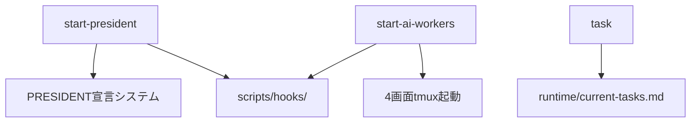
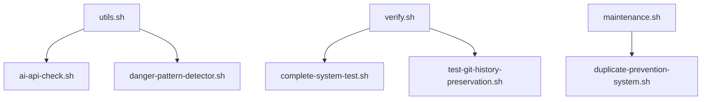

# 🔗 スクリプト依存関係マップ

**最終更新**: 2025-07-08T02:00:00+09:00  
**総スクリプト数**: 31個（78%削減達成）

## 📊 依存関係図

### Tier 1: コア起動スクリプト


### Tier 2: 統合ツール依存


## 🎯 スクリプト間の呼び出し関係

### 1. 起動フロー
- `start-president` → `setup-hooks.sh` → Git hooks有効化
- `start-ai-workers` → `check-cursor-rules` → ルール確認

### 2. テスト・検証フロー
- `verify.sh all` → 以下を順次実行:
  - `complete-system-test.sh`
  - `test-git-history-preservation.sh`
  - 内部実装の各種チェック

### 3. メンテナンスフロー
- `maintenance.sh all` → 以下を順次実行:
  - `duplicate-prevention-system.sh`
  - 内部実装のクリーンアップ

## ⚠️ 重要な依存関係

### 記憶継承システム
- `src/memory/core/runtime_advisor.py` ← `src/memory/persistent-learning/mistakes-database.json`
- `scripts/hooks/memory_inheritance_hook.py` → `runtime_advisor.py`

### AI API連携
- `ai-api-check.sh` → Gemini CLI / Claude Code CLI
- `danger-pattern-detector.sh` → `runtime/ai_api_logs/danger_patterns.json`

## 🔒 保護対象（削除禁止）
1. **記憶継承**: mistakes-database.json
2. **設定**: .specstory/, .vscode/
3. **ログ**: runtime/ai_api_logs/

---

**変更時の影響範囲確認方法**:
```bash
grep -R "source\|bash\|sh " scripts/ | grep [削除対象スクリプト名]
```